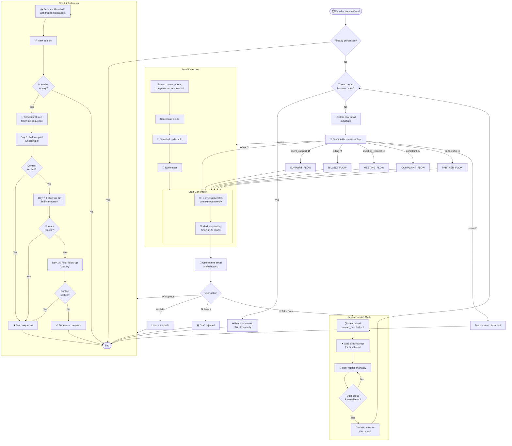
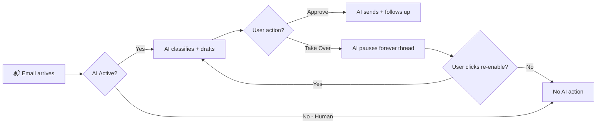
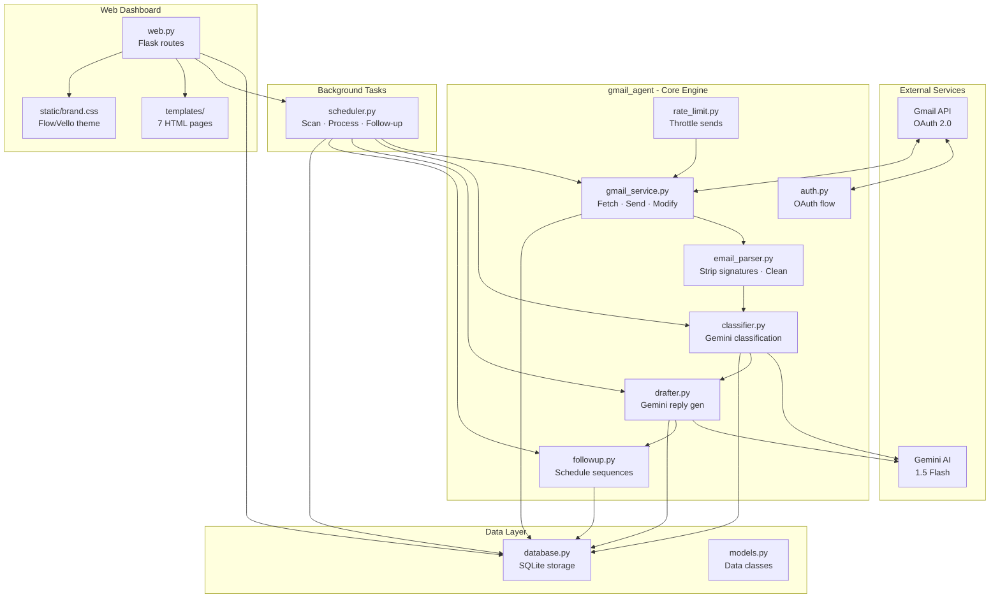
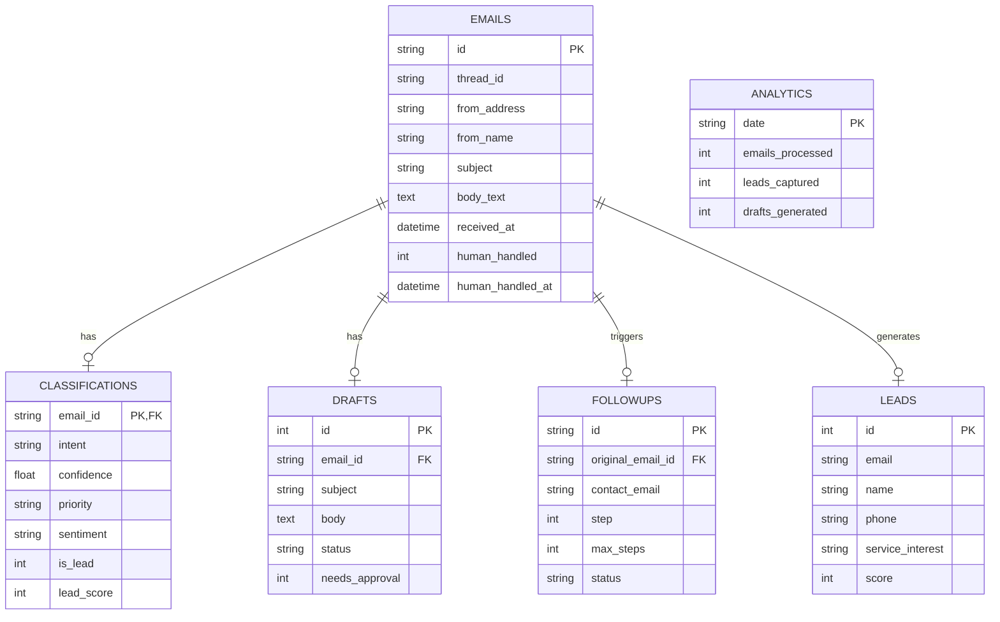

<div align="center">
  <br/>
  <h1>⚡ FlowVello · Gmail AI Agent</h1>
  <p><strong>Intelligent email automation for your agency — classify, draft, follow up, never miss a lead.</strong></p>
  <br/>

  <p>
    
    
    
    
    
  </p>

  <br/>
</div>

---

## 📋 Table of Contents

- [What It Does](#-what-it-does)
- [Full Feature List](#-full-feature-list)
- [UML Diagrams — System Workflow](#-complete-system-diagram--full-agent-workflow)
  - [Complete System Diagram](#-complete-system-diagram--full-agent-workflow)
- [Human Handoff](#-human-handoff)
- [Quick Start](#-quick-start)
- [Modes](#-modes)
- [Classification Categories](#-email-classification-categories)
- [Architecture](#-architecture)
- [Project Structure](#-project-structure)
- [Safety First](#-safety-first)
- [Tech Stack](#-tech-stack)
- [Deployment](#-deployment)

---

## 🧠 What It Does

FlowVello Gmail AI Agent connects to your agency's Gmail inbox and becomes your **AI email operations assistant**. It reads every incoming email, understands its intent using Gemini AI, drafts context-aware replies, presents them for your approval, sends them, and automatically follows up when there's no response. If you want to take over a conversation at any point, you can — the AI steps aside.

```
                    ┌──────────────────────────────────────┐
                    │       Incoming Email arrives          │
                    └──────────────────┬───────────────────┘
                                       │
                    ┌──────────────────▼───────────────────┐
                    │    1. AI Classifies Intent            │
                    │       (lead / support / billing /..)  │
                    └──────────────────┬───────────────────┘
                                       │
                    ┌──────────────────▼───────────────────┐
                    │    2. AI Generates Draft Reply        │
                    │       (context-aware, personalized)   │
                    └──────────────────┬───────────────────┘
                                       │
                    ┌──────────────────▼───────────────────┐
                    │    3. You Review + Approve            │
                    │       (or edit, or reject, or take    │
                    │        over the conversation)         │
                    └──────────────────┬───────────────────┘
                                       │
                    ┌──────────────────▼───────────────────┐
                    │    4. Reply Sent via Gmail API        │
                    └──────────────────┬───────────────────┘
                                       │
                    ┌──────────────────▼───────────────────┐
                    │    5. Auto Follow-up Sequence         │
                    │       Day 3 → Day 7 → Day 14          │
                    │       (stops if contact replies)      │
                    └──────────────────────────────────────┘
```

---

## ✨ Full Feature List

| # | Feature | Description | Human Role |
|---|---------|-------------|-----------|
| 1 | 📬 **Inbox Monitoring** | Continuously scans Gmail inbox for new emails via API | Passive — system monitors |
| 2 | 🧠 **AI Classification** | Gemini classifies each email: lead, support, billing, partnership, meeting_request, complaint, spam, or other | Review classification |
| 3 | 🔥 **Lead Detection** | Extracts name, phone (Pakistani +92), company, and service interest. Scores leads 0-100. Creates lead record | Review lead data |
| 4 | ✏️ **AI Draft Generation** | Gemini writes context-aware replies using FlowVello's knowledge base (services, tone, pricing) | Approve / Edit / Reject |
| 5 | ✅ **Human Approval Gate** | Every draft requires explicit approval before sending. No auto-sending for new conversations | Click approve or edit |
| 6 | 📤 **Send via Gmail API** | Sends approved replies with proper threading headers (In-Reply-To, References) | One-click approve |
| 7 | 🔄 **Follow-up Sequences** | Automatic 3-step follow-up: Day 3 ("checking in"), Day 7 ("still interested?"), Day 14 ("last try") | Monitor progress |
| 8 | 👤 **Human Handoff** | Take full control of any conversation — AI stops drafting, follow-ups stop. Re-enable AI anytime | Click "Take Over" |
| 9 | 📊 **Analytics Dashboard** | Tracks: emails processed, leads captured, drafts generated, replies sent, follow-ups sent, hours saved | View reports |
| 10 | 📋 **Daily Summary** | Auto-generated morning report: pending drafts, new leads, urgent emails, follow-ups due | Read & act |
| 11 | 🔐 **Rate-Limited Sending** | 4 sends/min max, 80/hr, 400/day. 3-second gap between sends. Proper email threading headers | Transparent |
| 12 | 🏷️ **Smart Filters** | Filter inbox by leads, urgent, support. Badges on every email row | Click filter |
| 13 | 🚫 **Spam Detection** | Classifies promotional/irrelevant emails as spam — skips processing | Review if needed |
| 14 | ⏹️ **Follow-up Stop on Reply** | Detects when contact replies and auto-stops the follow-up sequence | Automatic |
| 15 | 🖥️ **Web Dashboard** | Full Flask UI with sidebar navigation: Dashboard, Inbox, Drafts, Leads, Follow-ups, Analytics | All interaction |

---

## 📐 Complete System Diagram — Full Agent Workflow



---

## 👤 Human Handoff

The agent has a **Human-in-the-Loop** design. You are always in control.

### How It Works

| State | What Happens | AI Behavior |
|-------|-------------|-------------|
| **AI Active** (default) | AI classifies, drafts, follows up. You approve/reject | Fully active |
| **You Take Over** | You click "Take Over" on any email thread | AI stops for this thread |
| **Human Handling** | You reply manually. AI does nothing for this thread | Paused |
| **Re-enable AI** | You click "Re-enable AI" | AI resumes |

### When to Use Human Handoff

- **Complex negotiations** where AI might say the wrong thing
- **Sensitive topics** (complaints, legal, pricing disputes)
- **Personal relationships** where the client expects direct human interaction
- **Any time you want full control** of a conversation

### Button Locations

- **Email Detail page** — "👤 Take Over (Stop AI)" button next to the page header
- **Human Active** — A purple info card appears showing "You're handling this conversation"
- **Re-enable** — "🤖 Re-enable AI" button to bring AI back



---

## 🚀 Quick Start

### Prerequisites
- Python 3.10+
- A Gmail account (FlowVello's)
- A Google Cloud Project with Gmail API enabled
- A Gemini API key (free tier from aistudio.google.com)

### Setup (5 minutes)

```bash
# 1. Clone and install
git clone https://github.com/sulmanfarooqq/gmail_automation.git
cd gmail_automation/flowvello-agent
pip install -r requirements.txt

# 2. Add your Gemini API key
cp .env.example .env
# Edit .env → set GEMINI_API_KEY=your-key

# 3. Add Gmail API credentials
#    Download credentials.json from Google Cloud Console → place in project root

# 4. Run
python main.py --mode auth      # Login with your Gmail (one time)
python main.py --mode web       # Start dashboard at http://localhost:5000
```

### Modes

| Command | What It Does |
|---------|-------------|
| `python main.py --mode web` | Start the web dashboard (Flask) |
| `python main.py --mode scan` | One-time inbox scan + process |
| `python main.py --mode watch` | Continuous monitoring (scans every 5 min) |
| `python main.py --mode auth` | Set up Gmail OAuth (first time only) |
| `python main.py --mode summary` | Print today's email summary |

---

## 📊 Email Classification Categories

| Intent | Description | Auto-Replyable? | Follow-up? |
|--------|-------------|----------------|------------|
| `lead` | Someone asking about AI automation services | No (needs approval) | ✅ Yes |
| `client_support` | Existing client with a technical issue | Depends on complexity | No |
| `billing` | Payment, invoice, or pricing questions | No (needs approval) | No |
| `partnership` | Collaboration or partnership offer | No (needs approval) | Conditional |
| `meeting_request` | Asking to schedule a call/meeting | ✅ Yes (suggest times) | No |
| `complaint` | Negative feedback or complaint | No (human only) | No |
| `spam` | Promotional, newsletter, irrelevant | Skipped entirely | No |
| `other` | Everything that doesn't fit above | No | No |

---

## 🏗️ Architecture



## 📁 Project Structure

```
flowvello-agent/
├── main.py                    # Entry point (5 modes)
├── config.py                  # Configuration
├── requirements.txt           # Dependencies
├── .env.example               # Environment template
│
├── gmail_agent/               # Core engine
│   ├── auth.py                # Gmail OAuth 2.0
│   ├── gmail_service.py       # Fetch, send, manage
│   ├── email_parser.py        # Strip signatures, clean body
│   ├── classifier.py          # Gemini classification
│   ├── drafter.py             # Gemini reply generation
│   ├── followup.py            # Follow-up sequences
│   ├── database.py            # SQLite storage
│   ├── scheduler.py           # Background processing
│   ├── rate_limit.py          # Throttle sends (anti-flag)
│   └── models.py              # Data classes
│
├── dashboard/                 # Web interface
│   ├── web.py                 # Flask routes
│   ├── static/
│   │   └── brand.css          # FlowVello theme
│   └── templates/
│       ├── base.html          # Layout with sidebar
│       ├── dashboard.html     # Stats overview
│       ├── inbox.html         # Email list
│       ├── email_detail.html  # Full email + AI panel + Handoff
│       ├── drafts.html        # Pending approvals
│       ├── leads.html         # Lead table
│       ├── followups.html     # Active sequences
│       └── analytics.html     # Daily metrics
│
└── planning-flowvello/        # Documentation
    ├── 00-BRUTAL-REALITY-CHECK.md
    ├── 01-mvp-spec/
    ├── 02-gmail-integration/
    ├── 03-ai-pipeline/
    ├── 04-hosting/
    ├── 05-workflows/
    ├── 06-sales-packaging/
    └── 07-gmail-safety/
```

---

## 🔒 Safety First

This agent is built so your Gmail account **never gets flagged**:

| Protection | Detail |
|-----------|--------|
| **Official API** | Uses Gmail API (OAuth 2.0), not passwords or IMAP |
| **Rate Limited** | Caps at 4 sends/minute, 80/hour, 400/day |
| **Threaded Replies** | Proper In-Reply-To + References headers |
| **Human Approval** | No auto-sending — every draft needs your review |
| **Personalized** | Each reply is unique, not a template blast |
| **Reply-Only** | Only responds to people who email you first |

---

## 🛡️ Tech Stack

| Component | Technology |
|-----------|-----------|
| Language | Python 3.10+ |
| Web Framework | Flask 3.0 |
| AI | Google Gemini 1.5 Flash |
| Gmail | Google API Python Client |
| Database | SQLite (via sqlite3) |
| Styling | Custom CSS (FlowVello brand theme) |
| Auth | Gmail OAuth 2.0 |
| Diagrams | Mermaid.js (rendered by GitHub) |

---

## 🚢 Deployment

### Heroku (Recommended)

```bash
heroku create flowvello-agent
heroku addons:create heroku-postgresql:mini
heroku config:set GEMINI_API_KEY=your-key
heroku config:set FLASK_SECRET_KEY=your-secret
heroku config:set APP_URL=https://flowvello-agent.herokuapp.com
git push heroku main
```

### Docker (Alternative)

```dockerfile
FROM python:3.11-slim
WORKDIR /app
COPY . .
RUN pip install -r requirements.txt
CMD ["python", "main.py", "--mode", "web"]
```

---

## 📊 Database Schema



---

<div align="center">
  <p>
    Built for <strong>FlowVello</strong> — AI Automation Agency, Mirpur, Pakistan
  </p>
  <p>
    <sub>Gemini · Gmail API · Python · Flask · Mermaid</sub>
  </p>
  <br/>
</div>
